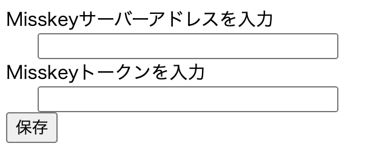
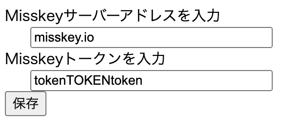
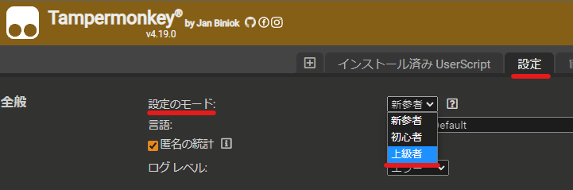
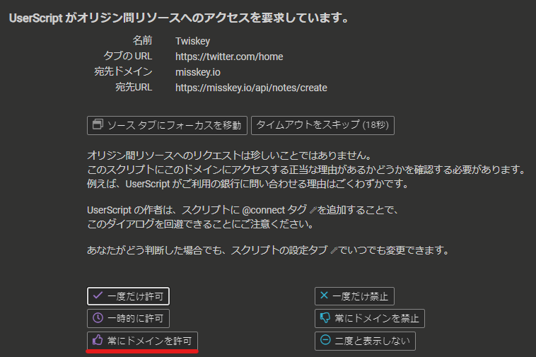

# Twiskey
Twitterへの投稿時に、Misskeyへの同時投稿ボタンを設置するスクリプトです。

[Greasy Fork](https://greasyfork.org/ja/scripts/463292-twiskey)からインストールしてください。([Tempermonkey](https://www.tampermonkey.net/)が必要です)

# 使い方

このスクリプトをインストールすると、Twitterの投稿画面の下部、ツイート送信欄の横のあたりにMisskeyのロゴが表示されます。

デフォルトではグレーアウトしていますが、これはMisskeyへの同時投稿が無効化されていることを表しています。


最初にクリックしたときに、図のようなフォームが表示されます。

自分のMisskeyアカウントに合わせて記入してください。(トークンはMisskeyの設定→API→アクセストークンの発行 から発行できます。ノートの作成権限だけで大丈夫なはずです。)



その後、ロゴをクリックすることで投稿機能のON/OFFを切り替えることができます。


なお、登録内容を変更したいなどの場合は、Tempermonkeyのスクリプト管理ページのストレージタブから書き換えることができます。

ストレージの内容を初期化する場合は以下のように`{`と`}`のみに変更して保存します。

```
{}
```


ストレージタブが表示されていない場合は、Tempermonkeyの設定->全般->設定のモード->上級者に切り替え、ページを再読み込み(F5)します。



初回実行時にTempermonkeyから警告が出ます。スクリプトとMisskeyの通信についてのものなので、「常に許可」を押してください。



# 注意点

- 動作は保証しません。
- TwitterやMisskeyのアップデートにより動作しなくなる可能性があります。
- Misskeyのトークンを文字列として保存しているため、流出に気をつけてください。
- 現状、画像付きのツイートなどには対応していません。
- Misskeyのカスタム絵文字はTwitterでは表示されません。

# プログラマーの方へ

何か気づいたことがある場合、issueを立てるか[Twitter](https://twitter.com/ZOI_dayo)にて連絡いただけるとありがたいです。対応できるかは分かりません...

Fork、PullReqなどもOKです。よろしくお願いします。
